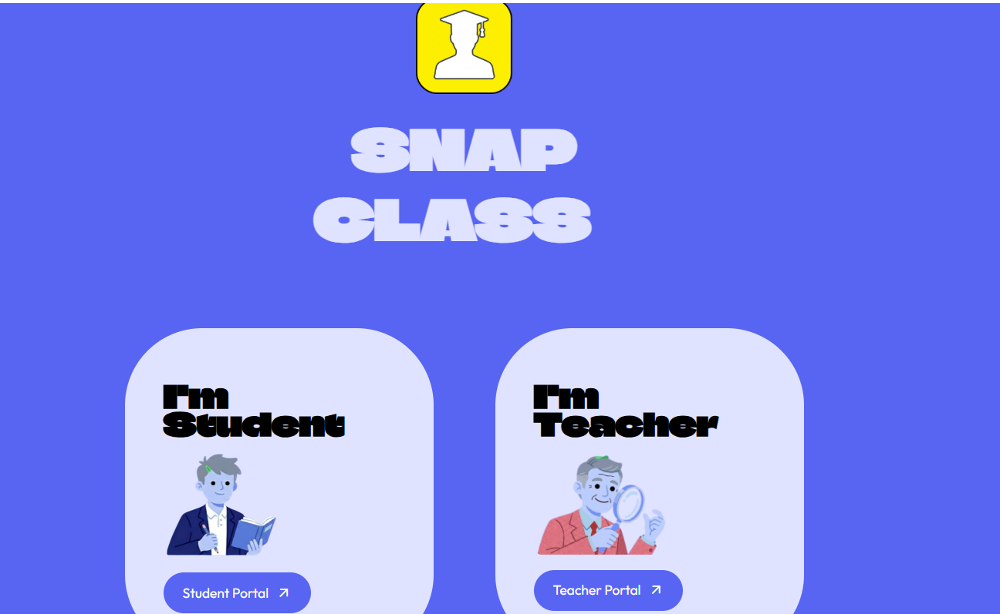
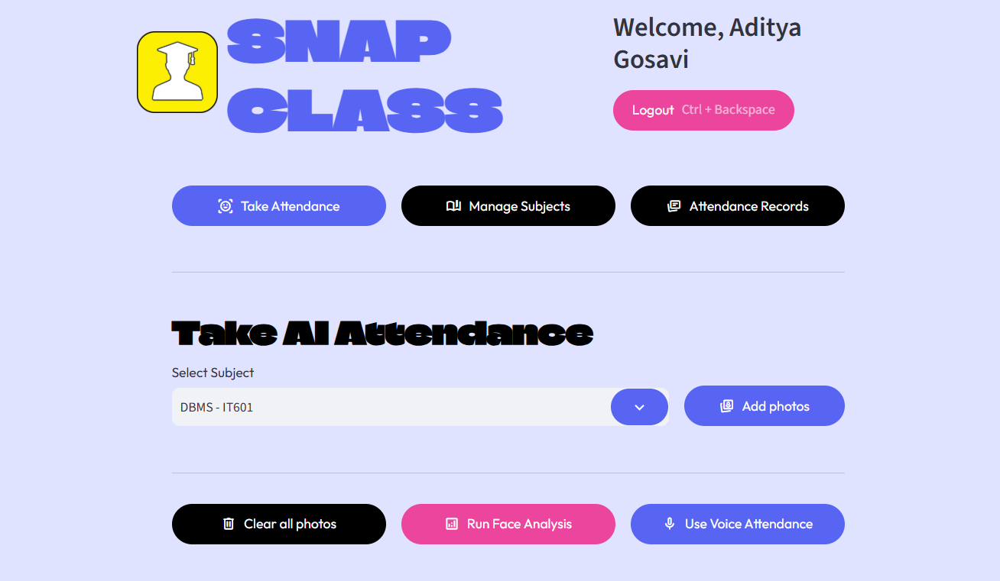
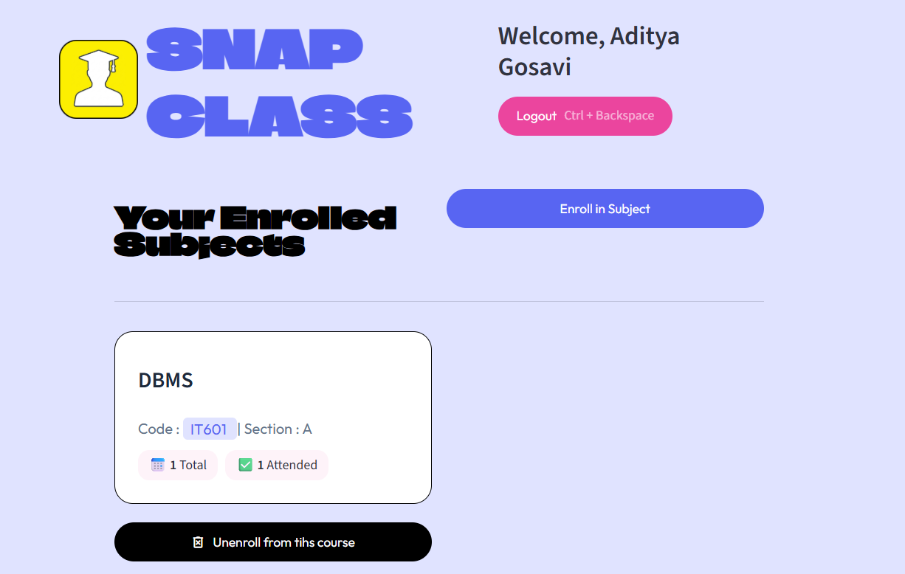
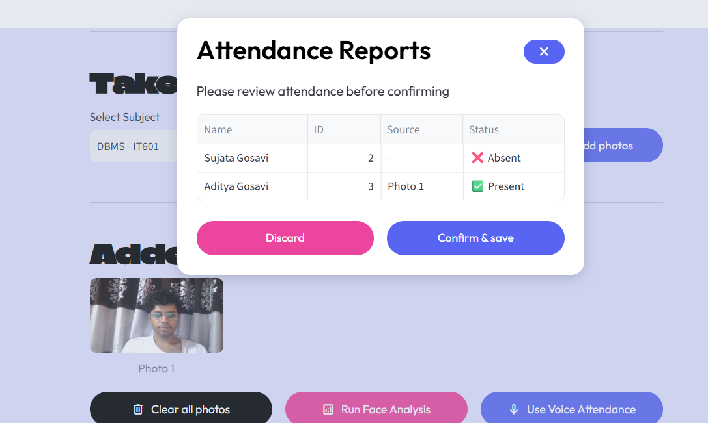
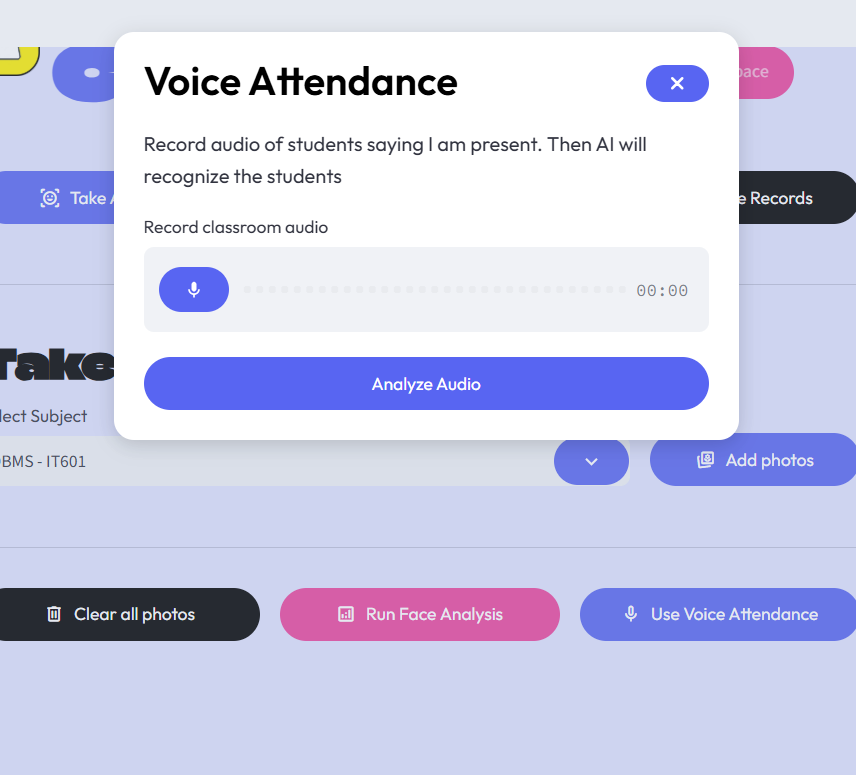
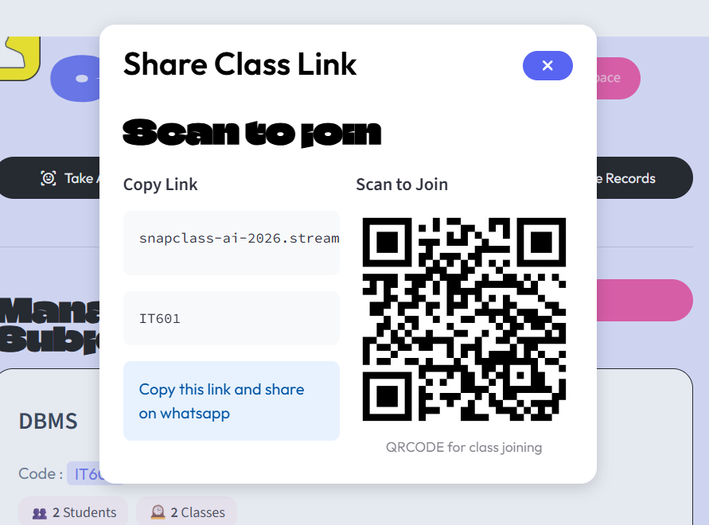

# 📸 SnapClass

An AI-powered classroom attendance system that automates attendance using **Face Recognition** and **Voice Recognition**. SnapClass provides separate teacher and student portals, subject enrollment, attendance tracking, and AI-based attendance management.

---

## 🚀 Features

### 👨‍🏫 Teacher Portal
- Secure username & password authentication
- Create and manage subjects
- Share subject enrollment links/QR codes
- Face Recognition attendance
- Voice Recognition attendance
- Attendance reports and session summaries

### 👨‍🎓 Student Portal
- Face recognition login
- New student registration
- Optional voice enrollment
- Subject enrollment using subject code
- View enrolled subjects
- View attendance statistics
- Unenroll from subjects

---

## 🤖 AI Features

- Face Detection & Recognition
- Voice Embedding & Recognition
- Automatic Attendance Logging
- AI-based Attendance Reports

---

## 🛠️ Tech Stack

### Frontend
- Streamlit

### Backend
- Python

### Database
- Supabase (PostgreSQL)

### Machine Learning
- OpenCV
- face_recognition
- scikit-learn
- NumPy
- Pandas

### Authentication
- bcrypt

---

## 📂 Project Structure

```
SnapClass/
│
├── src/
│   ├── components/
│   ├── database/
│   ├── pipelines/
│   ├── screens/
│   └── ui/
│
├── .streamlit/
│   └── secrets.toml
│
├── app.py
├── requirements.txt
└── README.md
```

---

## ⚙️ Installation

Clone the repository

```bash
git clone https://github.com/adityagosavi2005-cmyk/AI-Classroom-Attendance-System.git
```

Navigate into the project

```bash
cd AI-Classroom-Attendance-System
```

Create a virtual environment

```bash
python -m venv venv
```

Activate the virtual environment

Windows

```bash
venv\Scripts\activate
```

Linux/macOS

```bash
source venv/bin/activate
```

Install dependencies

```bash
pip install -r requirements.txt
```

---

## 🔐 Configure Supabase

Create

```
.streamlit/secrets.toml
```

Add

```toml
SUPABASE_URL="YOUR_SUPABASE_URL"
SUPABASE_KEY="YOUR_SUPABASE_KEY"
```

---

## ▶️ Run the Application

```bash
streamlit run app.py
```

---

## 📸 Screenshots

### Home Screen



### Teacher Dashboard



### Student Dashboard



### Face Attendance



### Voice Attendance



### Share Class Link



---

## 📌 Future Improvements

- Liveness Detection
- Email Notifications
- Mobile Responsive UI
- Attendance Analytics Dashboard
- QR Code Attendance
- Multi-Classroom Support

---

## 👨‍💻 Author

**Aditya Gosavi**

Fourth Year Information Technology Student

GitHub: https://github.com/adityagosavi2005-cmyk


---

## 📄 License

This project is intended for educational and portfolio purposes.